# Unity / C#のGCについて

基本的にこのドキュメントで言いたいことは[この記事](https://light11.hatenadiary.com/entry/2019/10/16/211435) に書かれているので、こっちを見る方が良いです。

Unity2020.3以降を使うなら、標準でインクリメンタルGCが有効になっているので、このページでいうGC Collectのスパイクは起こらないです。(本ページのことはそこまで気にしなくて良い)

## GCとは

G(ガーベッジ)C(コレクション)

使用していないメモリを回収して、利用可能なメモリを増やす機能。  

多くの高級言語に標準搭載されている。  
例: Basic, C#, Go, Java, Python, Ruby etc..

...というより、標準搭載していない言語が少ない。  
C, C++, Fortran, Rust ...あと何があるっけ?

## C#におけるGC

GC.Alloc: メモリを確保する  
GC.Collect: 確保したメモリを開放する

固定長配列(`T[]`,`string`)や可変配列(`List<T>`)、クラスを使うときにメモリを確保する。

## C#アプリケーションのメモリ構成

スタック領域(固定長データの領域)とヒープ領域(可変長データの領域)に分けられる。

可変長のデータを使用するために、ヒープ領域に本体を置き、スタック領域にはヒープ領域にある本体の番地を置く。



GC.Alloc:  
ヒープ領域の空いている所の場所取りをする処理。

GC.Collect:  
GC.Allocで確保されたヒープ領域の中で、使用していない部分を手放す処理。  
ほとんどの言語で、GC Collectはとても重く、そのタイミングのみCPUの使用率が跳ね上がる。

使い終わっているはずだがGC.Collectで回収されない場合、メモリリークと呼ばれたりする。

もうちょっと詳しく知りたい人は、[ufcpp-C# のメモリ管理](https://ufcpp.net/study/computer/MemoryManagement.html) あたりを読むといいかも。  
(コンピュータサイエンス系の本を読むのが一番だとは思いますが、めちゃくちゃ時間がかかるので覚悟がいります)

(**記憶の片隅に置いてもらえば良い知識**)  
GC.Allocと素朴な実装のGC.Collectを繰り返すと、ヒープ領域が虫食い状態になり、メモリの局所性を失う。  
キャッシュミスヒットが多くなり、メモリからキャッシュへの読み込み回数が上がり、処理速度が落ちる。  
なお、C#.netではGC.Collectで虫食いにならないように間を詰める操作(重い)も行うので気にしなくても良い。
言語やフレームワークによってはそうでもないので、気を付けよう。

キャッシュミスヒット:  
CPUにはキャッシュと呼ばれる小容量だがメモリよりも読み込みが速い記憶領域がある。  
プログラムを実行するとき、処理するものがキャッシュに乗っていない場合、メモリからキャッシュへの読み込みが必要になる。

## UnityにおけるGC

UnityのGC周りで具体的に何を避けた方が良いのかは、[Unity 公式マニュアル マネージヒープ](https://docs.unity3d.com/ja/2020.3/Manual/BestPracticeUnderstandingPerformanceInUnity4-1.html) にまとまっています。

C#のGCが動いている(はず)

GC.Alloc:  
ちょっと重い(一度に沢山使わなければ問題ない)

GC.Collect:  
とても重い。めちゃくちゃ重い。超絶重い。  
処理落ちの要因の一つ。  
VRの敵。FPSの敵。アクションゲームの敵。

一時的にGC.Allocして捨ててを繰り返すと、GC.Collectが重くなる。  
メモリを確保(Alloc)したら、その分開放(Collect)するのは自明だよね。

**過度に気にする必要はない**けど、Update等**毎フレーム呼ばれる場所に書く場合**はなるべく気にしよう。  
毎フレームGC.Allocして捨ててを繰り返すとGC.Collectが高頻度で呼ばれるようになる。

### よくない例1

```C#
public class DisplayTime: MonoBehaviour {
    private void Update(){
        // 毎フレームListを作って破棄します
        var positionList = new List<Vector3>{transform.position, transform.localPosition};
    }
}
```

### よくない例1 改善例

入れ物を作るのにGC.Allocしているので、  
毎フレーム要素が変わるような配列は入れ物を使いまわす。

```diff
public class DisplayTime: MonoBehaviour {
+   private readonly List<Vector3> _positionList = new List<Vector3>();
    private void Update(){
        // 毎フレームListを作って破棄します
-       var positionList = new List<Vector3>{transform.position, transform.localPosition};
+       _positionList.Add(transform.position)
+       _positionList.Add(transform.localPosition);
+
+       // 使い終わったら中の要素を空にする
+       _positionList.Clear();
    }
}
```

### よくない例2

```C#
public class DisplayTime: MonoBehaviour {
    [Header("UI設定部分")]
    [SerializeField, Tooltip("タイマー表示UIのテキスト部分をアタッチしてください")]
    private Text timerTextUI;

    private float _totalTime = 0;
    private void Update(){
        _totalTime += Time.deltaTime;

        // 今から4回GC.Allocします。
        string timerText =　"起動してから"; // 1
        timerText += _totalTime; // float->string: 2, +=: 3
        timerText += "秒が経ちました。"; // 4

        timerTextUI.text = timerText;
    }
}
```

### よくない例2 改善例

決まった文字列を結合するなら文字列補完を使おう。  
for文で結合するならStringBuilderで作ろう。  

参考: [MicroSoft: C# のコーディング規則 - 文字列型 (String)](<https://docs.microsoft.com/ja-jp/dotnet/csharp/programming-guide/inside-a-program/coding-conventions#string-data-type>)

#### 文字列補完

```diff
    private void Update(){
        _totalTime += Time.deltaTime;

-       // 今から4回GC.Allocします。
-       string timerText =　"起動してから"; // 1
-       timerText += _totalTime; // float->string: 2, +=: 3
-       timerText += "秒が経ちました。"; // 4
+       // 今から2回GC.Allocします。
+       string timerText = $"起動してから{_totalTime}秒が経ちました。"; // float->string: 1, 文字列結合: 2

        timerTextUI.text = timerText;
    }
```

#### StringBuilder

```diff
    private void Update(){
        _totalTime += Time.deltaTime;

-       // 今から4回GC.Allocします。
-       string timerText =　"起動してから"; // 1
-       timerText += _totalTime; // float->string: 2, +=: 3
-       timerText += "秒が経ちました。"; // 4
+       // 今から3回GC.Allocします。
+       StringBuilder timerText = new StringBuilder("起動してから", 40); // 1
+       timerText.Append(_totalTime); // float->string: 2
+       timerText.Append("秒が経ちました。");

-       timerTextUI.text = timerText;
+       timerTextUI.text = timerText.ToString(); // .ToString(): 3
    }
```

#### StringBuilderとよくない例1の複合

```diff
+   // 初回のみ1回GC.Alloc
+   private StringBuilder timerText = new StringBuilder(40);
    private void Update(){
        _totalTime += Time.deltaTime;

-       // 今から3回GC.Allocします。
-       string timerText =　"起動してから"; // 1
-       timerText += _totalTime; // 2
-       timerText += "秒が経ちました。"; // 3
+       // 今から3回GC.Allocします。(2回目以降は2回GC.Alloc)
+       timerText.Append("起動してから");
+       timerText.Append(_totalTime); // float->string: 2(2回目からは1)
+       timerText.Append("秒が経ちました。");

-       timerTextUI.text = timerText;
+       timerTextUI.text = timerText.ToString(); // .ToString(): 3(2回目からは2)
+       timerText.Clear(); // timerTextの中身を空にして、入れ物だけ再利用する
    }
```
